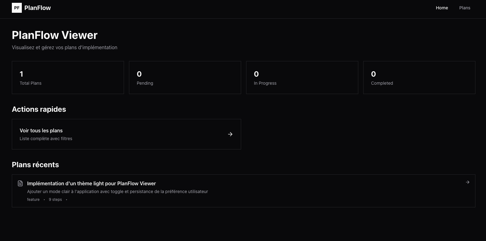
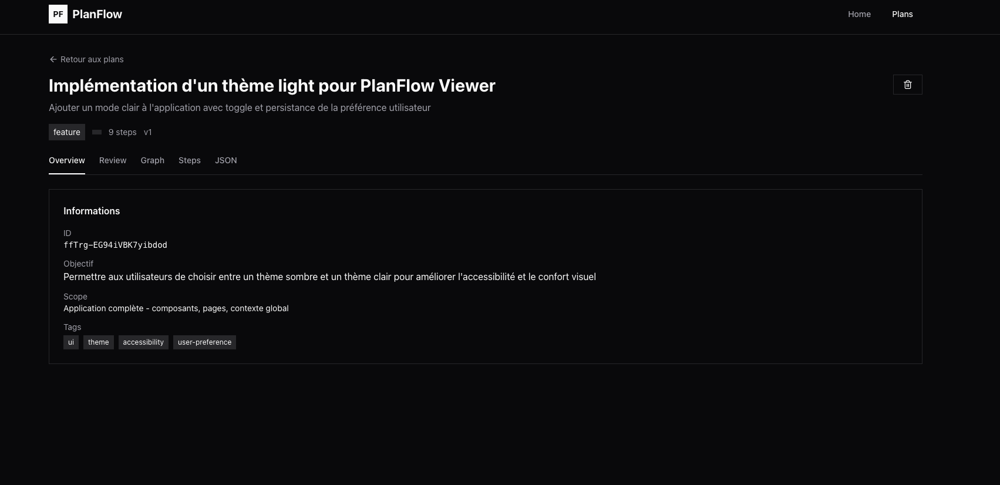
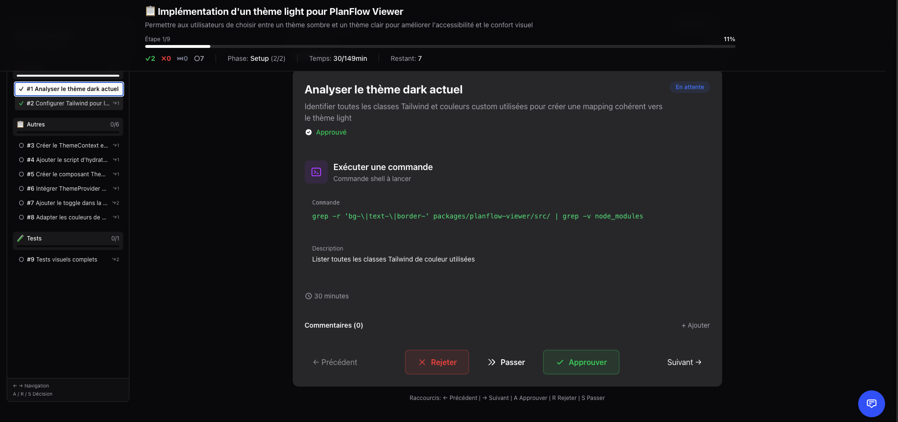
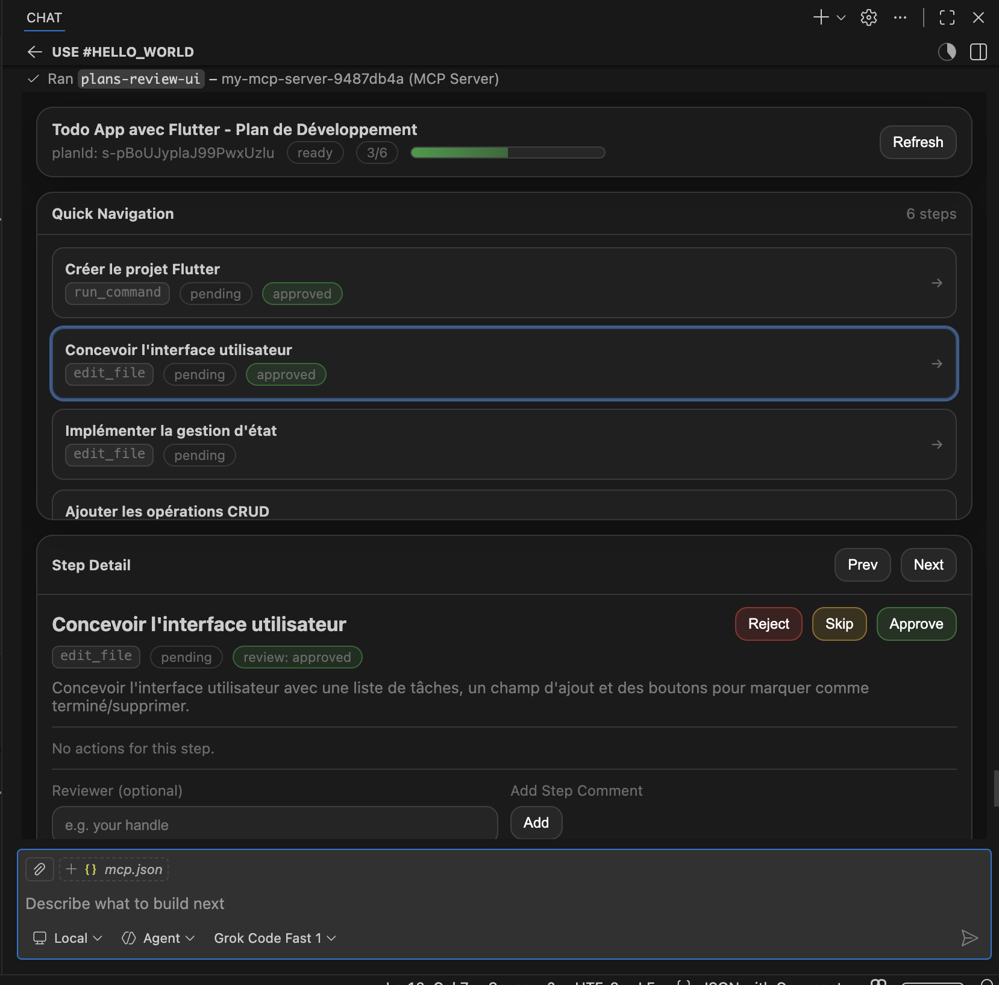
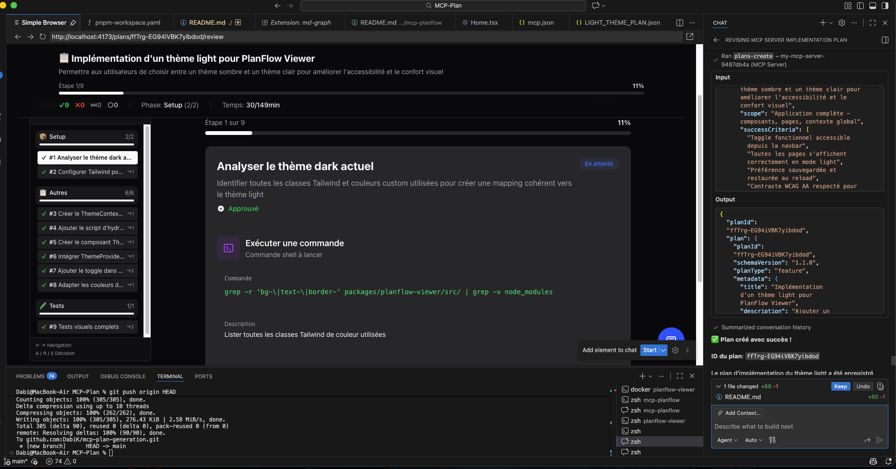

# 🎯 MCP PlanFlow

> **Gérez vos plans d'implémentation avec GitHub Copilot**

PlanFlow est un outil complet qui vous permet de créer, valider et reviewer des plans d'implémentation directement depuis VS Code. Grâce au **Model Context Protocol (MCP)**, dialoguez avec GitHub Copilot pour générer des plans structurés, puis utilisez l'interface web pour les reviewer visuellement.

**✨ Pourquoi PlanFlow ?**
- 🤖 **Intégration Copilot** : Créez des plans en langage naturel via MCP
- 📊 **Review visuelle** : Interface web moderne avec navigation par phases
- 💾 **Persistance** : MongoDB pour stocker et versionner vos plans
- ⚡ **Raccourcis clavier** : Review rapide avec A (approve), R (reject), S (skip)

## 🚀 Démarrage rapide

### Option 1 : Docker (recommandé)

```bash
# Cloner le projet
git clone <votre-repo>
cd MCP-Plan

# Démarrer l'environnement complet
  docker compose up --build
```

Accès :
- **Interface de review** : http://localhost:4173
- **API REST** : http://localhost:3000
- **MongoDB** : mongodb://localhost:27017

### Option 2 : Développement local

**Prérequis :** Node.js ≥ 18, pnpm ≥ 8, MongoDB local

```bash
# Installation
pnpm install

# Build
pnpm build

# Lancer les deux apps
pnpm dev
```

L'API tourne sur `http://localhost:3000` et l'interface sur `http://localhost:5174`.

## 🔧 Configuration VS Code avec MCP

Pour utiliser PlanFlow directement dans GitHub Copilot Chat, vous avez **deux options** :

### Option A : Mode stdio (lance une instance dédiée)

Le fichier `.vscode/mcp.json` est configuré pour lancer une nouvelle instance du serveur MCP :

```jsonc
{
  "mcpServers": {
    "planflow": {
      "command": "node",
      "args": ["${workspaceFolder}/packages/mcp-planflow/dist/index.js"],
      "env": {
        "MONGODB_URI": "mongodb://localhost:27017",
        "MONGODB_DB_NAME": "planflow",
        "NODE_ENV": "production",
        "HTTP_ENABLED": "false",
        "MCP_ENABLED": "true"
      }
    }
  }
}
```

**Avantages** : Simple, pas besoin de serveur séparé  
**Prérequis** : Build du projet (`pnpm --filter mcp-planflow build`)

### Option B : Mode HTTP (se connecte au serveur en cours)

Si vous avez déjà lancé le serveur via `pnpm dev` ou Docker, connectez-vous à celui-ci :

```jsonc
{
  "mcpServers": {
    "planflow-http": {
      "url": "http://localhost:3000/mcp"
    }
  }
}
```

**Avantages** : Réutilise le serveur existant, hot reload disponible, gestion de session  
**Prérequis** : Serveur lancé (`pnpm dev` ou `docker compose up`)  
**Transport** : StreamableHTTP (protocole moderne MCP 2025-11-25)

> **Fichier exemple** : Voir `.vscode/mcp-sse.json.example` pour la config HTTP complète

## 💡 Exemples d'utilisation

### Créer un plan d'implémentation

**Prompt :**
```
Crée-moi un plan d'implémentation pour ajouter un système d'authentification 
à mon app React avec JWT. Je veux :
- Login/register pages
- Protected routes
- Token refresh automatique
- Logout
```

Le MCP va générer un plan structuré avec étapes, dépendances, et validation.

### Valider un plan existant

**Prompt :**
```
Valide le plan "auth-system-v2" et dis-moi s'il y a des problèmes 
(dépendances circulaires, IDs dupliqués, etc.)
```

### Récupérer et analyser un plan

**Prompt :**
```
Récupère le plan "auth-system-v2" et montre-moi les étapes critiques 
sur le chemin de la feature principale
```

### Review d'un plan

**Prompt :**
```
Liste tous les plans en status 'draft' et montre-moi celui 
qui a le plus d'étapes bloquées
```

Vous pouvez ensuite ouvrir l'interface web pour reviewer visuellement :
```
http://localhost:4173/plans/{planId}/review
```

### Créer un plan avec architecture complexe

**Prompt :**
```
Génère un plan pour migrer notre backend Express vers NestJS :
- Phase 1 : Setup NestJS à côté de l'existant
- Phase 2 : Migration progressive des routes
- Phase 3 : Migration de la base de données
- Phase 4 : Décommissionnement de l'ancien code

Chaque phase doit avoir des étapes validables et des points de rollback.
```

## ✅ Bonnes pratiques avec GitHub Copilot

### Validation obligatoire des plans avant création

Pour garantir que vos plans sont **valides et bien formés**, nous recommandons d'ajouter une instruction dans votre fichier `Agent.md` (ou `.agent.md` selon votre setup) :

```markdown
## 📋 Validation des Plans d'Implémentation

Avant de créer un plan d'implémentation, **vous DEVEZ toujours :**

1. **Valider le plan en premier** : Utilisez l'outil `plans-validate` avec le contenu du plan
2. **Attendre la validation** : Assurez-vous que la réponse indique `"isValid": true`
3. **Corriger les erreurs** : Si des erreurs sont rapportées (path: `/steps/X/kind`, etc.), appliquez les corrections
4. **Créer uniquement après succès** : Une fois validé, utilisez `plans-create` avec le plan corrigé

### Exemple de flux correct :

```
[Plan JSON initial]
↓
plans-validate → Erreurs détectées ?
↓                    ↓
Non ✓            Oui → Corriger
↓                      ↓
plans-create      Revalider
```

### Bénéfices :
- ✅ Évite les allers-retours de correction
- ✅ Plans conformes au schéma PlanFlow v1.1.0
- ✅ Feedback immédiat sur les erreurs de structure
- ✅ Économise token budget et temps
```

## 🎯 Fonctionnalités

- **MCP Server** : 10 outils disponibles pour GitHub Copilot
  - Créer, valider, récupérer, mettre à jour des plans
  - Navigation dans les étapes (suivant, précédent, contexte)
  - Gestion des commentaires sur les plans et étapes
  
- **Interface Web** :
  - Review visuelle des plans étape par étape
  - MiniMap de navigation avec détection de phases
  - Commentaires sur les étapes
  - Export des reviews en JSON
  - Raccourcis clavier (A: approve, R: reject, S: skip)

- **Persistance MongoDB** : Tous vos plans sont sauvegardés et versionnés

## Outils MCP disponibles

| Outil | Description |
|-------|-------------|
| `plans-format` | Obtenir le schéma PlanFlow v1.1.0 complet |
| `plans-create` | Créer un nouveau plan |
| `plans-get` | Récupérer un plan par ID |
| `plans-update` | Mettre à jour un plan existant |
| `plans-list` | Lister les plans avec filtres |
| `plans-validate` | Valider un plan (schéma, cycles, etc.) |
| `steps-get` | Récupérer une étape spécifique |
| `steps-navigate` | Navigation (étape courante/suivante) |
| `steps-context` | Contexte d'une étape (dépendances) |
| `comments-manage` | Gérer les commentaires |

## Galerie d'écrans

### 🏠 Tableau de bord


La page d'accueil affiche :
- Statistiques rapides (Total Plans, Pending, In Progress, Completed)
- Accès rapide pour voir tous les plans
- Liste des plans récents

### 🔍 Vue détaillée du plan


L'interface de detail affiche :
- **Overview** : Métadonnées, objectif, scope, contraintes, critères de succès
- Informations du plan (ID, tags, version)
- Navigation entre onglets (Review, Graph, Steps)

### ⭐ Interface de review


Points clés de la review :
- **MiniMap** : Navigation visuelle par phases (Setup, Implementation, Testing...)
- **Étape active** : Affichage détaillé avec commandes shell, descriptions, durée estimée
- **Actions rapides** : Raccourcis clavier (A=Approuve, R=Rejette, S=Passe)
- **Commentaires** : Ajout de notes directement sur les étapes

### 🧩 MCP UI (Copilot Chat)


Capture de l'interface de review intégrée dans GitHub Copilot Chat (MCP Apps).

### 🤖 Intégration GitHub Copilot


Workflow complet :
- **Gauche** : Interface de review en temps réel
- **Droite** : GitHub Copilot Chat avec les outils MCP intégrés
- **Bottom** : Fichiers modifiés et terminal
- Création et validation du plan directement via chat

## 🛠️ Commandes utiles

```bash
# Arrêter Docker
docker compose down

# Nettoyer la base de données
docker compose down -v

# Rebuild après modifications
docker compose up --build

# Logs en temps réel
docker compose logs -f
```

## 📝 Licence

MIT
