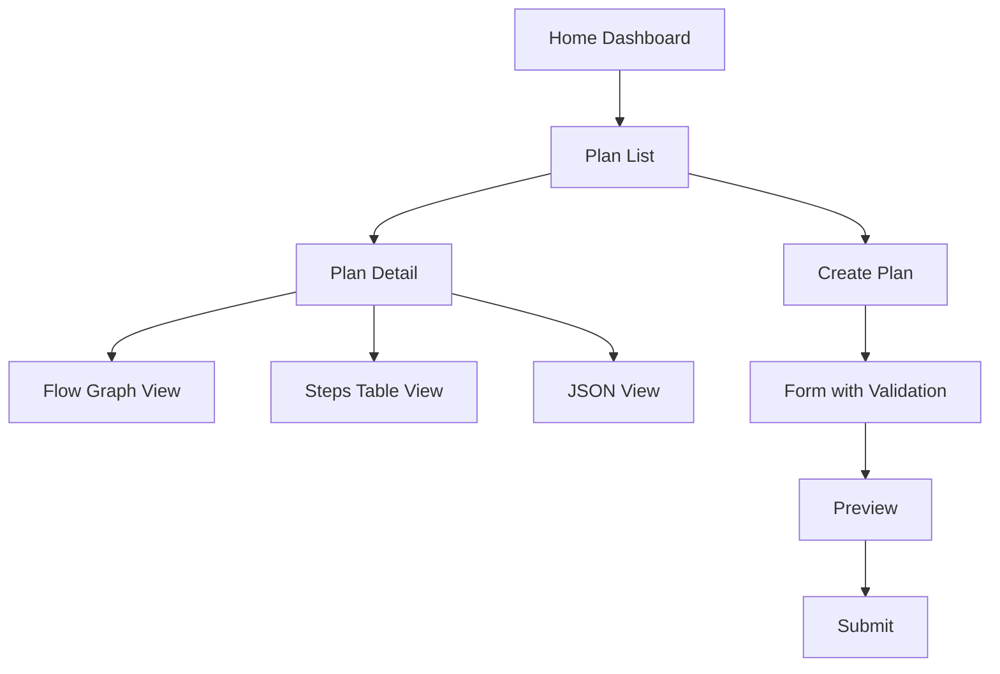

# Plan d'Implémentation - PlanFlow Viewer

## 🎯 Objectif
Créer une application React moderne pour visualiser et interagir avec les plans d'implémentation gérés par le serveur MCP PlanFlow. L'application utilisera ReactFlow pour afficher les dépendances entre étapes sous forme de graphe interactif.

## 📋 Stack Technique
- **Framework**: React 18 + TypeScript
- **Build Tool**: Vite 5
- **Visualisation**: ReactFlow (graphe de dépendances)
- **UI**: TailwindCSS + shadcn/ui
- **State Management**: Zustand
- **Routing**: React Router v6
- **Data Fetching**: TanStack Query (React Query)
- **Forms**: React Hook Form + Zod
- **Icons**: Lucide React
- **Date**: date-fns

## 📁 Architecture

```
packages/planflow-viewer/
├── src/
│   ├── components/          # Composants React réutilisables
│   │   ├── ui/             # Composants UI de base (shadcn/ui)
│   │   ├── layout/         # Layout components (Header, Sidebar, etc.)
│   │   ├── plan/           # Composants spécifiques aux plans
│   │   └── flow/           # Composants ReactFlow personnalisés
│   ├── pages/              # Pages de l'application
│   │   ├── Home.tsx
│   │   ├── PlanList.tsx
│   │   ├── PlanDetail.tsx
│   │   └── PlanCreate.tsx
│   ├── hooks/              # Custom React hooks
│   │   ├── usePlans.ts
│   │   ├── usePlanDetail.ts
│   │   └── useFlowGraph.ts
│   ├── stores/             # Zustand stores
│   │   └── planStore.ts
│   ├── services/           # Services API
│   │   └── planService.ts
│   ├── types/              # TypeScript types/interfaces
│   │   └── index.ts
│   ├── utils/              # Utilitaires
│   │   ├── flowHelpers.ts
│   │   └── formatters.ts
│   ├── lib/                # Configuration libraries
│   │   └── queryClient.ts
│   ├── App.tsx
│   ├── main.tsx
│   └── index.css
├── public/
├── AGENT.MD                # Bonnes pratiques React pour les agents IA
├── package.json
├── tsconfig.json
├── vite.config.ts
├── tailwind.config.js
└── postcss.config.js
```

---

## 🚀 Plan d'Implémentation (10 Phases)

### **Phase 1: Initialisation du Projet**

#### 1.1 Créer le projet Vite + React + TypeScript
```bash
cd packages
pnpm create vite planflow-viewer --template react-ts
cd planflow-viewer
```

#### 1.2 Installer les dépendances principales
```bash
pnpm install react-router-dom @tanstack/react-query reactflow zustand
pnpm install -D tailwindcss postcss autoprefixer
pnpm install lucide-react date-fns clsx tailwind-merge
pnpm install react-hook-form @hookform/resolvers zod
pnpm install mcp-planflow@workspace:*
```

#### 1.3 Configuration TailwindCSS
- Initialiser Tailwind: `npx tailwindcss init -p`
- Configurer `tailwind.config.js`
- Ajouter directives dans `index.css`

#### 1.4 Configuration TypeScript stricte
- Mettre à jour `tsconfig.json` avec options strictes
- Configurer path aliases (`@/components`, `@/hooks`, etc.)

```typescript
// vite.config.ts
import { defineConfig } from 'vite';
import react from '@vitejs/plugin-react';
import path from 'path';

export default defineConfig({
  plugins: [react()],
  resolve: {
    alias: {
      '@': path.resolve(__dirname, './src'),
    },
  },
  server: {
    port: 5173,
    proxy: {
      '/api': {
        target: 'http://localhost:3000',
        changeOrigin: true,
      },
    },
  },
});
```

#### 1.6 Variables d'environnement
```bash
# .env.local
VITE_API_URL=http://localhost:3000
```tion
- Ajouter proxy si nécessaire pour API backend

---

### **Phase 2: Documentation AGENT.MD**

#### 2.1 Créer AGENT.MD avec sections complètes
**Contenu à inclure:**

1. **Principes de base React**
   - Functional Components uniquement
   - Hooks rules (ordre, conditions)
   - Props destructuring et typing
   - Children pattern

2. **Structure des fichiers**
   - Naming conventions (PascalCase pour components, camelCase pour hooks)
   - Organisation des imports (React → libraries → local)
   - Export patterns (named vs default)

3. **TypeScript Best Practices**
   - Interfaces vs Types
   - Props typing (interface ComponentProps)
   - Generic types pour composants réutilisables
   - Avoid `any`, prefer `unknown`

4. **Performance**
   - Utilisation de `memo`, `useMemo`, `useCallback`
   - Éviter re-renders inutiles
   - Code splitting avec `lazy` et `Suspense`
   - Virtual scrolling pour grandes listes

5. **State Management**
   - useState pour state local
   - Zustand pour global state
   - React Query pour server state
   - Éviter prop drilling

6. **Styling**
   - TailwindCSS utility-first
   - cn() helper pour class merging
   - Responsive design (mobile-first)
   - Dark mode support

7. **Testing (structure future)**
   - Vitest pour unit tests
   - Testing Library pour components
   - MSW pour API mocking

8. **Accessibilité**
   - Semantic HTML
   - ARIA attributes
   - Keyboard navigation
   - Focus management

9. **Patterns à éviter**
   - Class components
   - Inline function definitions dans JSX
   - Direct DOM manipulation
   - Mutations d'objets/arrays

10. **ReactFlow spécifiques**
    - Custom nodes best practices
    - Edge styling et interactions
    - Layout algorithms (dagre, elkjs)
    - Performance avec grands graphes

---

### **Phase 3: Configuration UI Foundation**

#### 3.1 Installer shadcn/ui
```bash
pnpm dlx shadcn-ui@latest init
```

#### 3.2 Ajouter composants UI de base
```bash
pnpm dlx shadcn-ui@latest add button card input label select
pnpm dlx shadcn-ui@latest add dialog dropdown-menu tabs badge
pnpm dlx shadcn-ui@latest add toast table scroll-area
```

#### 3.3 Créer utilitaire cn()
```typescript
// src/lib/utils.ts
import { clsx, type ClassValue } from 'clsx';
import { twMerge } from 'tailwind-merge';

export function cn(...inputs: ClassValue[]) {
  return twMerge(clsx(inputs));
}
```

#### 3.4 Configurer React Query
```typescript
// src/lib/queryClient.ts
import { QueryClient } from '@tanstack/react-query';

export const queryClient = new QueryClient({
  defaultOptions: {
    queries: {
      staleTime: 60000,
      retry: 1,
    },
  },
});
```

#### 3.5 Setup Router
```typescript
// src/App.tsx
import { BrowserRouter, Routes, Route } from 'react-router-dom';
```

---

### **Phase 4: Types & Interfaces Partagés**

#### 4.1 Importer types de mcp-planflow
```json
// package.json
{
  "dependencies": {
    "mcp-planflow": "workspace:*"
  }
}
```

#### 4.2 Créer types locaux
```typescript
// src/types/index.ts
export type { PlanDTO, StepDTO } from 'mcp-planflow/dist/application/dtos';

export interface FlowNode {
  id: string;
  type: 'step';
  position: { x: number; y: number };
  data: {
    step: StepDTO;
    isBlocked: boolean;
    canExecute: boolean;
  };
}

export interface FlowEdge {
  id: string;
  source: string;
  target: string;
  type: 'dependency';
  animated?: boolean;
}

export interface PlanFilters {
  planType?: string;
  status?: string;
  search?: string;
}
```

---

### **Phase 5: Services API**

#### 5.1 Créer service de communication avec l'API REST
```typescript
// src/services/planService.ts
import type { PlanDTO, CreatePlanInputDTO } from 'mcp-planflow';

const API_BASE = import.meta.env.VITE_API_URL || 'http://localhost:3000';

export const planService = {
  async getFormat() {
    const res = await fetch(`${API_BASE}/api/plans/format`);
    if (!res.ok) throw new Error('Failed to fetch format');
    return res.json();
  },

  async validatePlan(plan: any) {
    const res = await fetch(`${API_BASE}/api/plans/validate`, {
      method: 'POST',
      headers: { 'Content-Type': 'application/json' },
      body: JSON.stringify(plan),
    });
    if (!res.ok) throw new Error('Failed to validate plan');
    return res.json();
  },

  async createPlan(data: CreatePlanInputDTO) {
    const res = await fetch(`${API_BASE}/api/plans`, {
      method: 'POST',
      headers: { 'Content-Type': 'application/json' },
      body: JSON.stringify(data),
    });
    if (!res.ok) throw new Error('Failed to create plan');
    return res.json();
  },

  async getPlan(id: string): Promise<PlanDTO> {
    const res = await fetch(`${API_BASE}/api/plans/${id}`);
    if (!res.ok) throw new Error('Failed to fetch plan');
    return res.json();
  },

  async updatePlan(id: string, updates: Partial<PlanDTO>) {
    const res = await fetch(`${API_BASE}/api/plans/${id}`, {
      method: 'PUT',
      headers: { 'Content-Type': 'application/json' },
      body: JSON.stringify(updates),
    });
    if (!res.ok) throw new Error('Failed to update plan');
    return res.json();
  },

  async deletePlan(id: string) {
    const res = await fetch(`${API_BASE}/api/plans/${id}`, {
      method: 'DELETE',
    });
    if (!res.ok) throw new Error('Failed to delete plan');
  },

  async listPlans(filters?: PlanFilters) {
    const params = new URLSearchParams();
    if (filters?.planType) params.append('planType', filters.planType);
    if (filters?.status) params.append('status', filters.status);
    if (filters?.limit) params.append('limit', filters.limit.toString());
    if (filters?.offset) params.append('offset', filters.offset.toString());
    
    const res = await fetch(`${API_BASE}/api/plans?${params}`);
    if (!res.ok) throw new Error('Failed to list plans');
    return res.json();
  },
};
```

#### 5.2 Créer custom hooks React Query
```typescript
// src/hooks/usePlans.ts
import { useQuery } from '@tanstack/react-query';
import { planService } from '@/services/planService';

export function usePlans(filters?: PlanFilters) {
  return useQuery({
    queryKey: ['plans', filters],
    queryFn: () => planService.listPlans(filters),
  });
}

// src/hooks/usePlanDetail.ts
export function usePlanDetail(planId: string) { /* ... */ }

// src/hooks/useCreatePlan.ts
export function useCreatePlan() { /* ... */ }
```

---

### **Phase 6: Layout & Navigation**

#### 6.1 Créer Layout principal
```typescript
// src/components/layout/AppLayout.tsx
- Header avec navigation
- Sidebar (optionnel)
- Main content area
- Toaster pour notifications
```

#### 6.2 Créer Header
```typescript
// src/components/layout/Header.tsx
- Logo
- Navigation links
- Theme toggle (dark mode)
- User menu (optionnel)
```

#### 6.3 Créer navigation
```typescript
// src/App.tsx
Routes:
- / → Home (dashboard)
- /plans → PlanList
- /plans/:id → PlanDetail
- /plans/new → PlanCreate
```

---

### **Phase 7: Pages Principales**

#### 7.1 Page Home (Dashboard)
```typescript
// src/pages/Home.tsx
- Statistiques (total plans, par statut, par type)
- Plans récents
- Quick actions (créer plan, etc.)
```

#### 7.2 Page PlanList
```typescript
// src/pages/PlanList.tsx
- Table des plans avec filtres
- Search bar
- Filtres (planType, status)
- Pagination
- Actions (view, edit, delete)
```

#### 7.3 Page PlanDetail
```typescript
// src/pages/PlanDetail.tsx
- Informations du plan (metadata, objective, etc.)
- Tabs: Overview | Flow Graph | Steps Table | JSON
- Actions (edit, delete, duplicate)
```

#### 7.4 Page PlanCreate
```typescript
// src/pages/PlanCreate.tsx
- Formulaire de création
- Validation avec Zod
- Preview du plan
- Submit avec feedback
```

---

### **Phase 8: Visualisation ReactFlow**

#### 8.1 Créer utilitaires de conversion
```typescript
// src/utils/flowHelpers.ts
export function planToFlowGraph(plan: PlanDTO): {
  nodes: FlowNode[];
  edges: FlowEdge[];
} {
  // Convertir steps en nodes
  // Créer edges depuis dependsOn
  // Appliquer layout algorithm (dagre)
}

export function calculateLayout(nodes, edges) {
  // Utiliser dagre pour auto-layout
}
```

#### 8.2 Créer Custom Node Component
```typescript
// src/components/flow/StepNode.tsx
- Afficher step info (title, kind, status)
- Status badge avec couleurs
- Duration badge
- Hover pour plus de détails
- Click pour sélectionner
```

#### 8.3 Créer FlowGraph Component
```typescript
// src/components/flow/FlowGraph.tsx
import ReactFlow, { 
  Background, 
  Controls, 
  MiniMap,
  useNodesState,
  useEdgesState,
} from 'reactflow';
import 'reactflow/dist/style.css';

- Custom nodeTypes
- Custom edgeTypes
- Controls (zoom, fit view)
- MiniMap
- Background grid
- Node selection
- Edge styling par état
```

#### 8.4 Intégration dans PlanDetail
```typescript
// Onglet Flow Graph dans PlanDetail
- Charger plan
- Convertir en flow graph
- Afficher avec ReactFlow
- Highlight path critique
- Legend pour les couleurs/statuts
```

---

### **Phase 9: Composants Plan**

#### 9.1 PlanCard Component
```typescript
// src/components/plan/PlanCard.tsx
- Afficher résumé du plan
- Badges (type, statut)
- Progress bar (steps completed)
- Actions rapides
```

#### 9.2 StepTable Component
```typescript
// src/components/plan/StepTable.tsx
- Table des steps avec tri
- Colonnes: ID, Title, Kind, Status, Duration, Dependencies
- Row actions (mark completed, etc.)
```

#### 9.3 PlanMetadata Component
```typescript
// src/components/plan/PlanMetadata.tsx
- Display metadata (title, description, author, tags)
- Dates (created, updated)
- Revision number
```

#### 9.4 StepStatusBadge Component
```typescript
// src/components/plan/StepStatusBadge.tsx
- Badge coloré selon status
- Pending: gray
- In Progress: blue
- Completed: green
- Failed: red
- Blocked: orange
- Skipped: purple
```

---

### **Phase 10: Features Avancées & Polish**

#### 10.1 Zustand Store pour UI state
```typescript
// src/stores/planStore.ts
- Selected plan/step
- Filters state
- View preferences (grid vs list)
- Theme
```

#### 10.2 Dark Mode
```typescript
// Utiliser Tailwind dark mode
// Toggle dans Header
// Persister dans localStorage
```

#### 10.3 Responsive Design
```typescript
// Mobile-first approach
// Breakpoints: sm, md, lg, xl
// Mobile navigation (drawer)
// Responsive table (scroll ou stack)
```

#### 10.4 Loading & Error States
```typescript
// Skeleton loaders
// Error boundaries
// Empty states
// Toast notifications
```

#### 10.5 Validation & Forms
```typescript
// React Hook Form
// Zod schemas
// Field validation
// Error messages
```

#### 10.6 Export/Import Features
```typescript
// Export plan as JSON
// Import plan from JSON
// Download plan as PDF (optionnel)
```

#### 10.7 Search & Filters
```typescript
// Search plans par titre/description
// Filter par planType
// Filter par status
// Sort par date, titre, etc.
```

---

## 📊 Diagramme de Flow



---

## 🎨 Design System

### Couleurs (TailwindCSS)
- Primary: Blue (indigo-600)
- Success: Green (emerald-500)
- Warning: Orange (orange-500)
- Error: Red (red-500)
- Neutral: Gray (slate-*)

### Status Colors
- Pending: gray-400
- In Progress: blue-500
- Completed: green-500
- Failed: red-500
- Blocked: orange-500
- Skipped: purple-500

### Typography
- Font: Inter (Google Fonts)
- Headings: font-bold
- Body: font-normal
- Code: font-mono

---

## 🧪 Tests (Phase Future)

### Unit Tests
- Utility functions (flowHelpers, formatters)
- Custom hooks

### Component Tests
- StepNode rendering
- PlanCard interactions
- Forms validation

### Integration Tests
- Page flows
- API integration
- ReactFlow interactions

---

## 📦 Scripts package.json

```json
{
  "scripts": {
    "dev": "vite",
    "build": "tsc && vite build",
    "preview": "vite preview",
    "lint": "eslint . --ext ts,tsx",
    "format": "prettier --write \"src/**/*.{ts,tsx}\"",
    "clean": "rm -rf dist node_modules"
  }
}
```

---

## 🔗 Intégration avec MCP Server

### ✅ API REST Disponible

L'API REST est **déjà implémentée** dans le serveur MCP PlanFlow et est prête à être utilisée.

**Base URL**: `http://localhost:3000/api/plans`

### Endpoints Disponibles

#### 1. **GET /api/plans/format**
Récupère la spécification du schéma JSON.

```typescript
const format = await fetch('http://localhost:3000/api/plans/format');
```

#### 2. **POST /api/plans/validate**
Valide un plan contre le schéma et les règles métier.

```typescript
const result = await fetch('http://localhost:3000/api/plans/validate', {
  method: 'POST',
  headers: { 'Content-Type': 'application/json' },
  body: JSON.stringify(planData)
});
```

#### 3. **GET /api/plans**
Liste tous les plans avec filtres optionnels.

```typescript
// Sans filtres
const plans = await fetch('http://localhost:3000/api/plans');

// Avec filtres
const filteredPlans = await fetch(
  'http://localhost:3000/api/plans?planType=feature&limit=10'
);
```

**Query Parameters:**
- `planType`: `feature`, `bugfix`, `refactor`, etc.
- `status`: `pending`, `in_progress`, `completed`, etc.
- `limit`: Nombre max de résultats
- `offset`: Pagination offset

#### 4. **GET /api/plans/:id**
Récupère un plan spécifique par son ID.

```typescript
const plan = await fetch(`http://localhost:3000/api/plans/${planId}`);
```

#### 5. **POST /api/plans**
Crée un nouveau plan.

```typescript
const result = await fetch('http://localhost:3000/api/plans', {
  method: 'POST',
  headers: { 'Content-Type': 'application/json' },
  body: JSON.stringify(newPlanData)
});
// Returns: { planId: string, plan: PlanDTO }
```

#### 6. **PUT /api/plans/:id**
Met à jour un plan existant.

```typescript
const updated = await fetch(`http://localhost:3000/api/plans/${planId}`, {
  method: 'PUT',
  headers: { 'Content-Type': 'application/json' },
  body: JSON.stringify({ metadata: { title: 'Updated' } })
});
```

#### 7. **DELETE /api/plans/:id**
Supprime un plan.

```typescript
await fetch(`http://localhost:3000/api/plans/${planId}`, {
  method: 'DELETE'
});
// Returns: 204 No Content
```

### Configuration

**Variables d'environnement serveur** (`.env` dans `mcp-planflow/`):
```env
HTTP_ENABLED=true
HTTP_PORT=3000
HTTP_HOST=0.0.0.0
CORS_ORIGIN=http://localhost:5173
```

**Variables d'environnement viewer** (`.env.local` dans `planflow-viewer/`):
```env
VITE_API_URL=http://localhost:3000
```

### Notes Importantes

- ✅ **Pas d'altération des données**: L'API utilise exactement les mêmes DTOs que le serveur MCP
- ✅ **CORS configuré**: Accepte les requêtes depuis `http://localhost:5173` (Vite dev server)
- ✅ **Types partagés**: Importer les types depuis `mcp-planflow` workspace
- ✅ **Validation automatique**: Tous les plans sont validés avant création/mise à jour
- ✅ **Codes HTTP standards**: 200, 201, 400, 404, 500

### Documentation Complète

Voir [mcp-planflow/API.md](../mcp-planflow/API.md) pour la documentation complète de l'API avec exemples curl.

---

## ✅ Checklist Phase par Phase

- [ ] Phase 1: Projet Vite initialisé
- [ ] Phase 2: AGENT.MD créé avec toutes les bonnes pratiques
- [ ] Phase 3: UI foundation (shadcn, TailwindCSS, React Query)
- [ ] Phase 4: Types importés et définis
- [ ] Phase 5: Services API et hooks React Query
- [ ] Phase 6: Layout et navigation
- [ ] Phase 7: Pages principales (Home, List, Detail, Create)
- [ ] Phase 8: ReactFlow intégration et visualisation
- [ ] Phase 9: Composants Plan (Card, Table, Metadata, Badges)
- [ ] Phase 10: Features avancées (dark mode, responsive, etc.)

---

## 📚 Ressources

- [ReactFlow Docs](https://reactflow.dev)
- [shadcn/ui Components](https://ui.shadcn.com)
- [TanStack Query](https://tanstack.com/query)
- [Zustand](https://docs.pmnd.rs/zustand)
- [React Router](https://reactrouter.com)

---

## 🚀 Ordre d'Implémentation Recommandé

1. **Phase 1**: Setup projet (30 min)
2. **Phase 2**: AGENT.MD (1h)
3. **Phase 3**: UI Foundation (1h)
4. **Phase 4**: Types (30 min)
5. **Phase 6**: Layout basique (1h)
6. **Phase 5**: API mock + hooks (1h)
7. **Phase 7**: Pages simples (2h)
8. **Phase 9**: Composants Plan (2h)
9. **Phase 8**: ReactFlow (3h)
10. **Phase 10**: Polish (2h)

**Total estimé**: ~14h

---

Prêt à commencer ? 🚀
